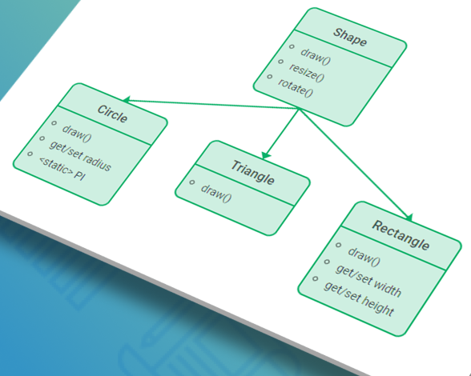

# POO : Polymorphisme

```
La programmation Orientée Objet repose sur 4 principes.
Le polymorphisme est, sans doute aucun, le plus importants.
- Moi
```

### Problematique : l'oiseau et la poule

#### contexte
Nous avons un super logiciel, écrit par nos predecesseurs les Sages.
1. Animal
2. Vache

```java
public class Animal {
    public void crier() {
        System.out.println("!!!");
    }
}
```

```java
public class Vache {
    public void crier() {
        System.out.println("mouh");
    }
}
```


#### US
Marc, mon PO, m'a fait la remarque que les Poules, bien qu'étant des Oiseaux,

### Definition : polymorphisme 


```
insert photo here
```



## Methode et Procedure

un objet, en java, est définit par un état (des ATTRIBUTs) et un comportement (METHODE).
la rupture qui l'a fait se demarquer des autres paradigmes, celui de la programmation procedurale par exemple
c'est la notion de comportement.

## Loi de Demeter


```
Formellement, la Loi de Déméter pour les fonctions requiert que toute méthode M d'un objet O peut simplement invoquer les méthodes des types suivants d'objets :

    1. O lui-même
    2. les paramètres de M
```

