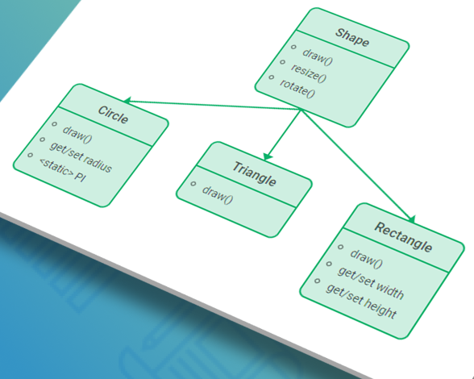

# Programmation Orientee Objet vs Programmation procedurale


```
insert quote here
```

programmation fonctionnelle, procédurale, ou encore POO (programmation orienté objet), dans l'histoire de l'informatique, plusieurs paradigmes ont existé afin de rendre fluide l'ecriture des logiciels.

chacun répond à une problématique bien défini, et comporte des forces dans un champ d'utilisation mais présente des limitation dans d'autres.

parfois ces paradigmes ne sont pas exclusifs les uns les autres, comme la programmation fonctionnelle et la POO,
qui cohabitent ensemble dans dans le langage Java par exemple.

mais certains presentent une approche de representation redicalement differente. 

exemple : POO et la programmation procédurale. 
- quels sont les principales similarité et les points de difference entre ces 2 paradigmes ?


```
insert photo here
```


## Methode et Procedure

un objet, en java, est définit par un état (des ATTRIBUTs) et un comportement (METHODE).
la rupture qui l'a fait se demarquer des autres paradigmes, celui de la programmation procedurale par exemple
c'est la notion de comportement.

en effet, bien que la programmation procedurale utilise le concept de PROCEDURE, qui est  similaire en apparence à celui de METHODE, ces 2 notions presentent des differences fondamentales.

l'état, définit par les attribut de l'instance, son controlés en suivant le principe de l'ENCAPSULTATION.
ce principe permet de controler notemment la visibilité de l'état de nos objet, avec l'utilisation du fameux mot "private".
le comportement de notre instance, representé par les methodes, lui est divisé entre 2 catégories principalement :
- comportement exposé à l'exterieur de l'objet (PUBLIC)
- comportement reservé (PRIVATE...)


plusieurs regles gouvernent cette exposition : loi de Demeter, Open/Closed principles que je ne vais pas couvrir dans cette article.


## Loi de Demeter


```
Formellement, la Loi de Déméter pour les fonctions requiert que toute méthode M d'un objet O peut simplement invoquer les méthodes des types suivants d'objets :

    1. O lui-même
    2. les paramètres de M
    3. les objets que M crée/instancie
    4. les objets membres de O
```

